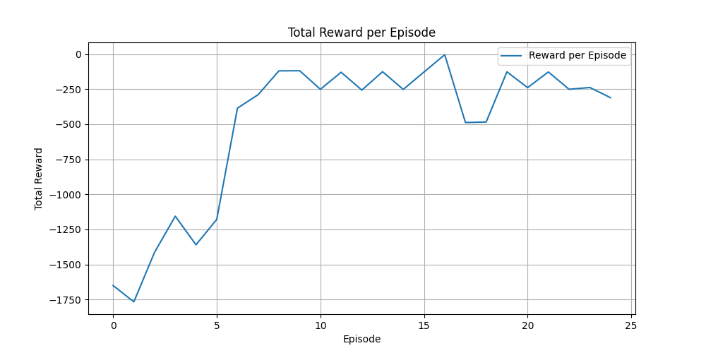
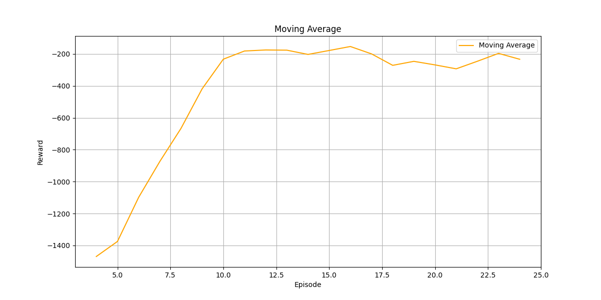

# inverted-pendulum-DQN
 A Reinforcement Learning model (DQN) addressing the inverted pendulum problem

# Overview

This project implements a Deep Q-Network (DQN) to balance an inverted pendulum. The model is trained using the OpenAI Gym environment.

# Dependencies

Install the required dependencies by running the following command:

`pip install -r requirements.txt`

# Train

To train the DQN model, execute the following command from the root directory:

`python main.py`

Training progress and results (plots and animations) will be saved in the visualizations folder.

# Results

# Licence

This project is licensed under the MIT License.

# Author 

Li Sheng

Feel free to reach out for any questions or collaboration opportunities!

